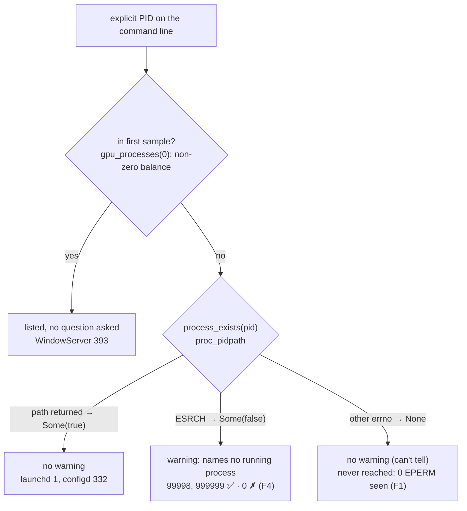

# Field check v0.2.13 on Apple Silicon (issue #3) — Findings (v0)

Date: 2026-10-01

---
type: findings
topic: field_check_v0213
date: 2026-10-01
version: v0
prior-version: none
key-metric: issue-3 checks passing as worded: 8/8 (prior: N/A, delta: N/A)
decision-required: confirm
---

## Headline Result

```
metric:    issue #3 checks passing as worded
value:     8 / 8   (+ 4 findings outside the wording; 1 premise of check 3 is false on this OS)
unit:      checks
prior:     N/A (first run of v0.2.13 on macOS)
direction: new
```

Environment: macOS 26.6.2 (25G83), Apple M3 Pro, arm64, rustc 1.92.0, commit `cf5ada0`,
binary `target/release/hmn` → `hmn 0.2.13`. These results come from an unprivileged user (`hacker`).

## Results Tables

### The eight checks

| # | Check | Verdict | Key evidence |
|---|---|---|---|
| 1 | `cargo test --all-features` | ✅ PASS | exit 0; 338 passed, 0 failed, 11 ignored across 11 test binaries; `process_exists_finds_this_process ... ok`, `process_exists_does_not_find_an_impossible_pid ... ok` |
| 2 | dead-PID warning, dead PID only | ✅ PASS | stderr `hmn watch: pid=999999 names no running process; its rows will read 0 MiB`; nothing for Safari (2561) |
| 3 | no warning for other-user/root PIDs | ✅ PASS, but see F1 | no warning for WindowServer 393 (`_windowserver`), launchd 1 (root), configd 332 (root) |
| 4 | spill summary wording, `?` cells, JSON | ✅ PASS | `spill not measurable on this platform; per-PID VRAM below`; `"measurable":false`, `"spilling_at_attach":null` (parsed) |
| 5 | `--top 5` alignment | ✅ PASS | 0 misaligned cells by display width; names up to 44 chars |
| 6 | `ps --filter`, case-insensitive, `--exit-status` | ✅ PASS | `sAfArI` matches Safari; `filter="sAfArI"` echoed; exit 0 / 1 |
| 7 | `ps --device 1` → exit 2 + prefix | ✅ PASS, but see F2 | exit 2; message body is wrong |
| 8 | `--help` lists commands before Limitations | ✅ PASS | `Commands:` at offset 1440, `Limitations (per-platform):` at 3513 |

### Syscall probe of `process_exists`'s inputs (verifier, python ctypes plus a throwaway Rust crate)

| PID | Owner | `proc_pidpath` | `ledger` read | In `gpu_processes(0)` | `process_exists` | Did `watch` ask it? |
|---|---|---|---|---|---|---|
| 393 WindowServer | `_windowserver` | 86 B, errno 0 | rc 0, balance > 0 | yes | `Some(true)` | no (already listed) |
| 1 launchd | root | 13 B, errno 0 | rc 0, balance 0 | no | `Some(true)` | yes → no warning |
| 332 configd | root | 20 B, errno 0 | rc 0, balance 0 | no | `Some(true)` | yes → no warning |
| 99998 (dead) | — | 0, ESRCH | rc −1, ESRCH | no | `Some(false)` | yes → warns ✅ |
| 999999 (> PID max) | — | 0, ESRCH | rc −1, ESRCH | no | `Some(false)` | yes → warns ✅ |
| 0 kernel_task | root | 0, **ESRCH** | — | no | `Some(false)` | yes → **warns ✗** |

Across the whole system: `ledger` returned rc 0 for **253 / 253** cross-user PIDs (root
included), with **0 EPERM**. `proc_pidpath` succeeded for 935 / 936 PIDs; the one failure was the
probe's own short-lived `ps` (ESRCH).

## Observations

| Signal | Baseline / Expected | Observed [source] | Interpretation |
|---|---|---|---|
| `ledger` read on cross-user PIDs | issue #3 and `--help`: returns `EPERM`, so the PID is skipped | rc 0 for 253/253, 0 EPERM; WindowServer listed with 264–515 MiB across runs [source: evidence/verify_cli.md] | **F1.** The premise is false on macOS 26.6.2. The `None` ("can't tell") branch of `metal::process_exists` is never reached as a non-root user, so check 3 tests "no false ESRCH" but not the EPERM path. |
| `--help` macOS limitation text | accurate | says cross-user PIDs are "silently skipped — … returns `EPERM`" [source: `src/bin/hmn/main.rs:169-171`; similar at `ps.rs:505-509`, `metal.rs:5-11, 610-613, 682-684`, `gpu/mod.rs:374-377`] | **F3.** These docs are stale for this OS, or were never right. main.rs:169-171 and ps.rs:505-509 checked by hand; the metal.rs/mod.rs sites are doc comments of the same claim. |
| `ps --device 1`, one device | `DeviceIndexOutOfRange { index: 1, count: 1 }` | `no GPU measurement source available (NVML, DXGI, PDH, and nvidia-smi all failed or are disabled)` [source: evidence/cli/c7_*] | **F2.** `bounds_check` (`src/gpu/mod.rs:604-624`) has NVML and DXGI branches but no Metal branch, while `device_count()` uses `metal::device_count`. Falls through to `NoGpuSource`. Exit code and prefix are correct. |
| `hmn watch 0` | kernel_task exists, so no warning | `pid=0 names no running process` [source: coordinator re-ran it] | **F4.** `proc_pidpath(0)` returns ESRCH. A minor false positive; PID 0 is an unlikely input. |
| Check-2 PID 999999 | a dead but possible PID | macOS PID max is 99999; `ps -p 999999` → "process id too large" [source: evidence/checks2_8_cli.md] | The check passes but cannot catch PID reuse. Re-tested with 99998 (in range, dead): warns correctly. |
| Column padding | by display width | header 97 chars / 99 bytes (two `Δ`); aligned [source: evidence/verify_cli.md §5] | Pads by `char`, which is correct for these names. Wide CJK or emoji names would likely misalign (not tested). |

## Charts & Visualizations

How `hmn watch` decides to warn on macOS, with this run's PIDs shown on the branch each took:



The `None` branch exists for the case the issue had in mind, a cross-user PID whose reads get
EPERM. On this OS that case does not happen.

## Contradictions & Surprises

- The issue says that for WindowServer, `hmn cannot list such a process's GPU memory`, but `hmn ps`
  lists it unprivileged with 264–515 MiB (across runs). The help text has the same claim.
- The JSON summary carries `"spilled":false` next to `"measurable":false`. A consumer that reads
  `spilled` without checking `measurable` would misread it as "no spill".
- `cargo test` covers the two `process_exists` unit tests, but not the two Metal tests in
  `tests/macos_smoke.rs`, which stay `#[ignore]`. They were not run here. To run them:
  `cargo test --test macos_smoke -- --ignored`.

## Steering Questions

- [now] Post the tick-list comment on issue #3 with F1–F4? It is drafted from this report and
  waits for approval.
- [now] File a `docs/dogfooding-feedbacks/` write-up plus PR (the issue invites one "if something
  is wrong")? F1 and F3 are wrong docs, and F2 is a wrong error message.
- [next run] Find the macOS versions where `ledger` really returns EPERM, if any (sandboxed
  processes, older macOS, SIP-protected PIDs). That decides whether F3 means rewording the help
  text or deleting the claim.
- [next run] Run the ignored `macos_smoke` Metal tests on the M3 Pro to close the remaining gap.
- [later] Add a Metal branch to `bounds_check` (F2), special-case PID 0 (F4), and decide whether
  `spilled` should be `null` when `measurable` is false.

## Pointers

- Issue: https://github.com/mi-for-the-rust-of-us/hypomnesis/issues/3
- Dogfooding write-up: [dogfooding-macos-cross-user-ledger-and-device-bounds.md](../../docs/dogfooding-feedbacks/dogfooding-macos-cross-user-ledger-and-device-bounds.md)
- Evidence, check 1: [evidence/check1_tests.md](evidence/check1_tests.md)
- Evidence, checks 2–8: [evidence/checks2_8_cli.md](evidence/checks2_8_cli.md)
- Verification: [evidence/verify_cli.md](evidence/verify_cli.md); probes in [evidence/probes/](evidence/probes/) (`p.py` proc_pidpath, `l.py` ledger scan, `rs/` crate-API probe)
- Code: `src/gpu/metal.rs:710-731`, `src/gpu/mod.rs:56-60, 450-457, 604-624`, `src/bin/hmn/watch.rs:964-977, 1175`, `src/bin/hmn/main.rs:165-171`
- Background: `docs/roadmap-v0.2.13.md`, `docs/dogfooding-feedbacks/style_guide.md`
