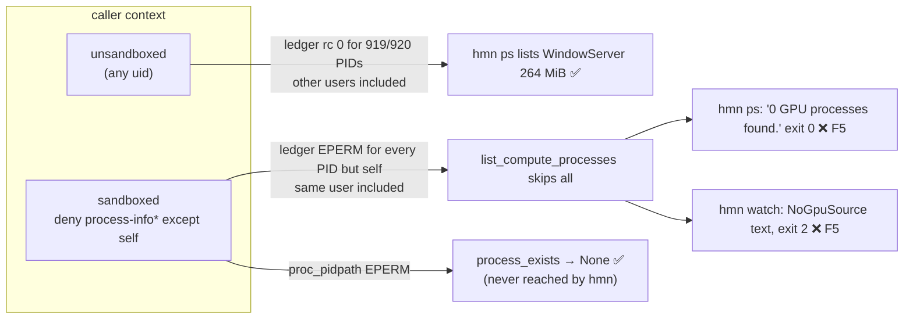

# Field check v0.2.13 on Apple Silicon (issue #3) — Findings (v1)

Date: 2026-10-01

---
type: findings
topic: field_check_v0213
date: 2026-10-01
version: v1
prior-version: __reports__/field_check_v0213/00-findings_v0.md
key-metric: issue-3 checks passing as worded: 8/8 (prior: 8/8, delta: 0)
decision-required: confirm
---

## Headline Result

```
metric:    issue #3 checks passing as worded
value:     8 / 8; 6 findings (F1 revised, F5 and F6 new)
unit:      checks
prior:     8 / 8, 4 findings (v0)
direction: stable (checks); findings up
```

**What changed since v0:** v0 said "no `EPERM` on macOS 26.6.2". The PI asked whether the parent
app's grants could be hiding a prompt. A controlled sandbox on/off probe shows that `EPERM` is
decided by the **caller's sandbox, not process ownership** (F1, revised). It also shows that a
sandboxed `hmn` reports a **silent zero** (F5). F6 is the PI's `n/a` vs `?` proposal, checked
against the repo's own conventions.

Environment: macOS 26.6.2 (25G83), Apple M3 Pro, rustc 1.92.0, commit `cf5ada0`, `hmn 0.2.13`,
uid 501.

## Results Tables

### The eight checks (unchanged from v0)

| # | Check | Verdict | Key evidence |
|---|---|---|---|
| 1 | `cargo test --all-features` | ✅ | exit 0; 338 passed, 0 failed, 11 ignored; both `process_exists` tests `ok` |
| 2 | dead-PID warning only | ✅ | warning for 999999 only; 99998 also warns |
| 3 | no warning, other-user/root | ✅ (F1) | 393, 1, 332: no warning |
| 4 | spill wording, `?`, JSON | ✅ (F6) | `spill not measurable…`; `measurable:false`, `spilling_at_attach:null` |
| 5 | `--top 5` alignment | ✅ | 0 misaligned cells by display width |
| 6 | `ps --filter`, `--exit-status` | ✅ | `sAfArI` matches; exit 0 / 1 |
| 7 | `ps --device 1` | ✅ (F2) | exit 2; wrong message body |
| 8 | `--help` order | ✅ | `Commands:` at 1440 < `Limitations` at 3513 |

### `ledger` / `proc_pidpath` by sandbox × ownership (`ctypes` probe, responsible app = Claude Code, PID 25217, in both columns)

Sandbox profile: `(allow default)(deny process-info*)(allow process-info* (target self))`

| PID | Owner | Unsandboxed | Sandboxed |
|---|---|---|---|
| 393 WindowServer | `_windowserver` | rc 0 / path ok | `EPERM` / `EPERM` |
| 1 launchd | root | rc 0 / path ok | `EPERM` / `EPERM` |
| 2561 Safari | **same user** | rc 0 / path ok | **`EPERM` / `EPERM`** |
| self | same user | rc 0 / path ok | rc 0 / path ok |
| all 920 PIDs | mixed | 919 rc 0, 1 `ESRCH`, **0 `EPERM`** | not scanned |

### `hmn` under that sandbox

| Command | Unsandboxed | Sandboxed |
|---|---|---|
| `hmn ps` | WindowServer 264 MiB, Safari, WebKit… | `0 GPU processes found.`, exit **0** |
| `hmn ps --filter safari --exit-status` | exit 0 | exit **1**, the "no match" code |
| `hmn watch 393 1 999999 99998` | rows plus 2 dead-PID warnings | exit 2, `NoGpuSource` text |
| same, only `process-info-ledger` denied | — | WindowServer `0 MiB`, no notice |
| same, `process-info*` denied on self too | — | exit 133, Apple `libdispatch` abort (not `hmn`) |

## Observations

| Signal | Baseline / Expected | Observed [source] | Interpretation |
|---|---|---|---|
| Cause of `EPERM` | docs: another user's process | same-user Safari `EPERM` when sandboxed; other users rc 0 when not [source: evidence/probes/sandbox_probe.py run] | **F1.** The gate is the caller's sandbox (a MAC policy hook), not uid. The doc claim at 7 sites is wrong both ways, and the `sudo` advice is unproven. |
| Sandboxed `hmn ps` | an "unreadable" notice, non-zero exit | `0 GPU processes found.`, exit 0 [source: coordinator run] | **F5.** `list_compute_processes` (`metal.rs:619-708`) skips every failed read and returns `Some(vec![])`. A wrong measurement is reported as a correct one: the worst failure for an instrument. |
| `--exit-status` when sandboxed | distinguishes "unreadable" | exit 1, the same code as "no match" | Part of F5; breaks CI gates silently. |
| `process_exists` `None` arm | reached for unreadable PIDs | reached by the probe (`proc_pidpath` `EPERM`), not by `hmn watch`, which exits 2 first | The arm is right; its doc example should say "sandboxed". The cause of `watch`'s exit 2 is not traced. |
| `ps --device 1` | `DeviceIndexOutOfRange{1,1}` | `NoGpuSource` text [source: evidence/cli/c7_*] | **F2.** `bounds_check` (`gpu/mod.rs:604-624`) has no Metal branch. |
| `hmn watch 0` | no warning | `pid=0 names no running process` | **F4.** `proc_pidpath(0)` returns `ESRCH`. |
| SPILL/PAGED cells on UMA | not applicable, so `n/a` (README's own term) | `?`, which the README defines as "isn't measurable" | **F6.** `?` conflates "doesn't apply" with "unreadable now" and also means "unresolved name" in NAME; JSON `spilled:false` beside `measurable:false`. |

## Charts & Visualizations

Where `EPERM` comes from, and what `hmn` makes of it:



## Contradictions & Surprises

- v0's headline "no `EPERM` on this OS" held only for an unsandboxed caller. The PI's question
  about parent-app permissions led to the controlled test that overturned it.
- Ownership is irrelevant both ways: the caller's own Safari is unreadable under a sandbox, and
  root's launchd is readable without one.
- A harsher sandbox, one that also denies `process-info*` on self, crashes `hmn` (`SIGTRAP`)
  inside Apple's `libdispatch` before `hmn` code runs. This is not a `hmn` bug, but worth one line
  in the docs.

## Steering Questions

- [now] Approve handing F1–F6 and the small notes to a fresh agent, in a new worktree, for a fix
  plan in this repo's idiom (suggested task).
- [now] The issue comment is held back by the PI: "we will not report things without solutions".
  Post it once the plan exists?
- [next run] Try a real App Sandbox, `sudo` under a sandbox, and one run from Terminal.app. That
  last one is the remaining parent-app residual.
- [next run] Decide Linux on F6's `n/a` rule: it OOMs rather than pages, but managed-memory
  oversubscription exists.
- [later] Run the ignored `macos_smoke` Metal tests; test wide (CJK/emoji) name alignment.

## Pointers

- Prior version: [00-findings_v0.md](00-findings_v0.md)
- Dogfooding write-up: [dogfooding-macos-sandbox-eperm-and-device-bounds.md](../../docs/dogfooding-feedbacks/dogfooding-macos-sandbox-eperm-and-device-bounds.md)
- Evidence: [evidence/check1_tests.md](evidence/check1_tests.md), [evidence/checks2_8_cli.md](evidence/checks2_8_cli.md), [evidence/verify_cli.md](evidence/verify_cli.md)
- Probes: [evidence/probes/](evidence/probes/): `p.py`, `l.py`, `sandbox_probe.py`, `rs/` (crate-API probe)
- Issue: https://github.com/mi-for-the-rust-of-us/hypomnesis/issues/3
- Code: `src/gpu/metal.rs:610-708, 710-731`; `src/gpu/mod.rs:56-60, 450-457, 604-624`; `src/bin/hmn/watch.rs:964-977, 1175`; `src/bin/hmn/main.rs:165-196`; `src/bin/hmn/ps.rs:505-509`
